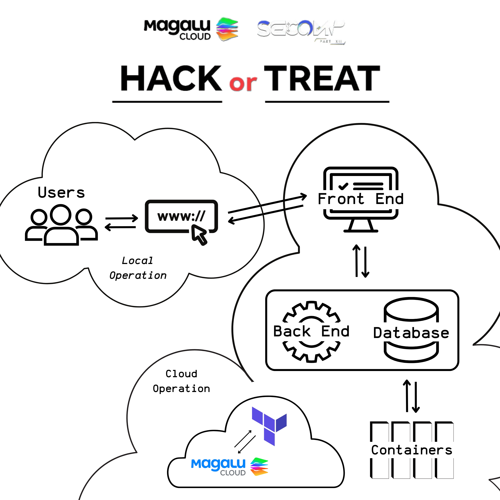

# Working on scalability in the configuration of an "Online Judge" in the cloud

**Abstract**: studies on server configuration for code and algorithm analysis, as an "Online Judge". 

**Document language/documentation language**: English.

**Programming language**: HCL.
**Programmimg language (Open-Source Project Used as Online Judge)**: HTML, Ruby, Shell, Dockerfile.

**Autor**: Kevyn Marques, Maristella Ramalho Rangel, Yara dos Santos Rodrigues, Matheus de Almeida Mazieiro.

---

### Application

The entire project arose in the context of developing a solution for a real problem, utilizing tools provided by Magalu Cloud (MGC), the first Brazilian cloud platform with a global scale, by leveraging virtual machines (VMs) and concepts such as load balancing.
The problem that inspired this solution was a programming marathon during which the application server hosting the challenges crashed. This incident prompted the authors to consider the possibility of creating their own server with configurations designed to prevent a recurrence of the issues they experienced.

### Portability

The project does not focus on portability, however, the idea is to create a complete and simple documentation which, consequently, will allow anyone to use the codes available in the repository as a template and adjustments could be done to accommodate new use cases.

### Architecture

The architecture of a server for an open-source online judge consists of several layers and components. The back-end processes incoming requests, managing the solution evaluation logic and interacting with a database that stores information about users, problems, and results. This setup presents a significant challenge: maintaining consistency during peak submission periods while ensuring that the infrastructure can support a large number of users.

Objectives:
- Containerize the application using Docker, particularly the database, to ensure a consistent and isolated environment.
- Use Terraform to provision cloud infrastructure, defining resources such as server instances and security configurations.

This modular and scalable architecture ensures that the server can accommodate a growing number of users and challenges while maintaining efficiency, security, and consistency.
